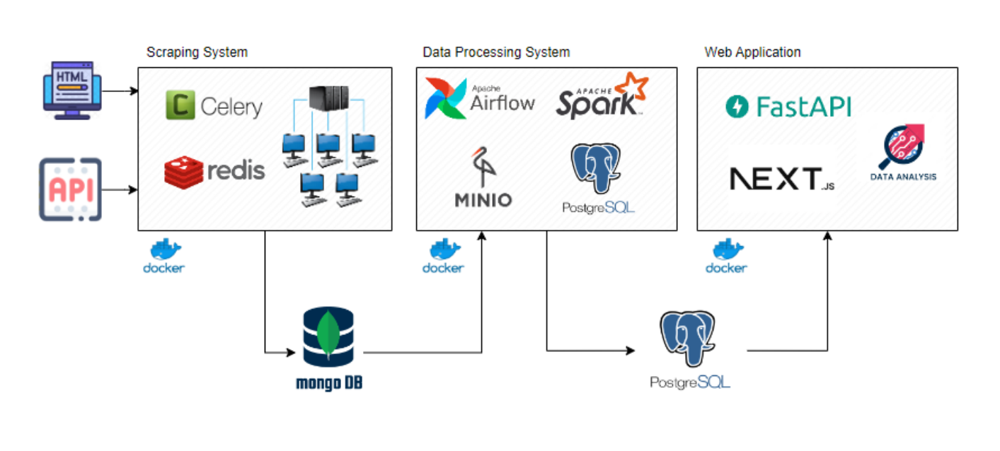
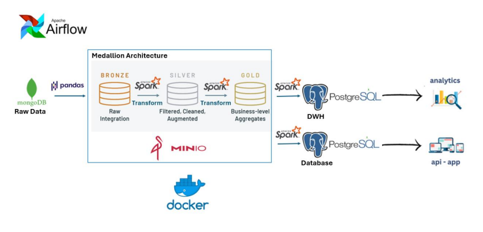
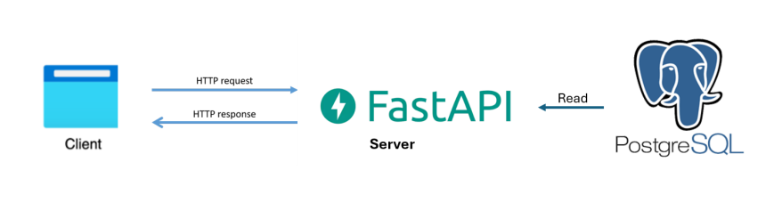
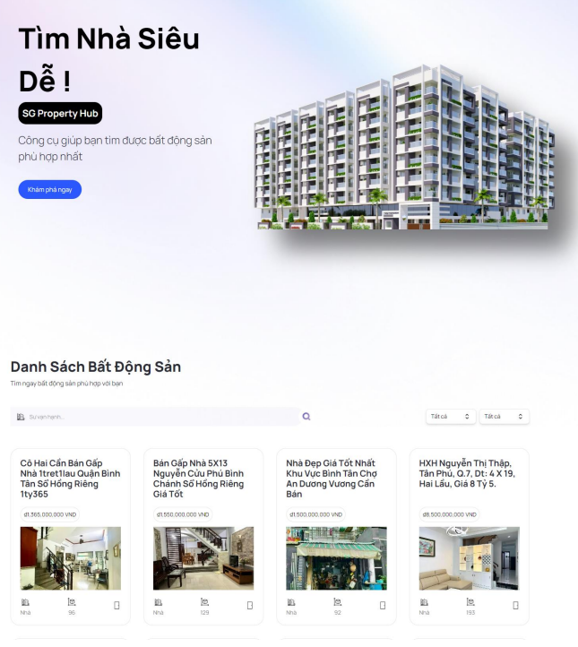
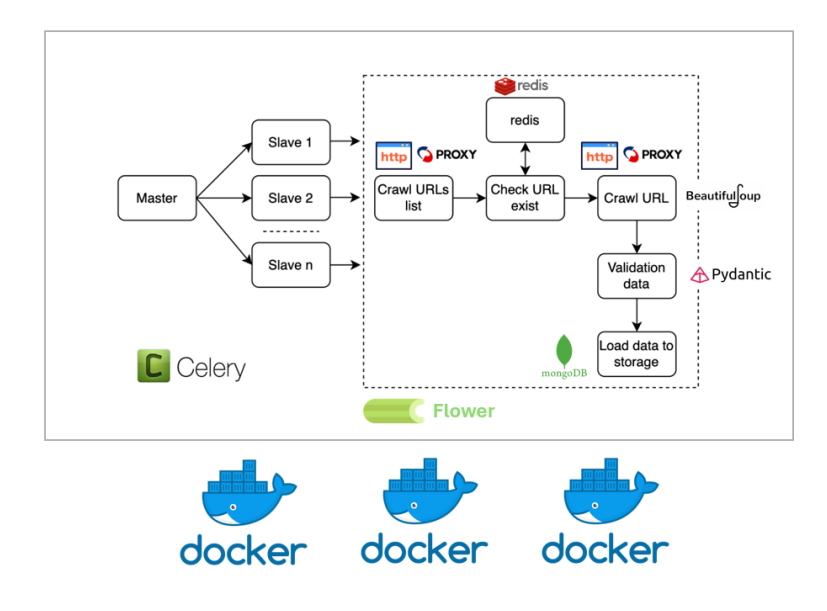

# SG Property Hub

## Overview

SG Property Hub is a comprehensive platform for managing and analyzing property data. It consists of multiple components including a back-end API, a data pipeline, a front-end application, and a property crawler worker. Each component is containerized using Docker for easy deployment and orchestration.



## Components

### Data Pipeline

The data pipeline component handles data processing tasks using Apache Spark and Apache Airflow.


- **DAGs**: Contains Airflow DAGs for orchestrating data workflows.
- **Spark**: Contains Spark jobs for data processing.
- **MinIO**: Used for object storage.
- **Dependencies**: Managed using `requirements.txt`.


### Back-End

The back-end component provides APIs and database management functionalities.


- **API**: Contains the API logic.
- **DB**: Contains database-related scripts and configurations.
- **Dependencies**: Managed using `requirements.txt`.


### Next-Hub

The front-end application built with Next.js.

- **Components**: Reusable UI components.
- **Utilities**: Helper functions and utilities.
- **Configuration**: Next.js and Tailwind CSS configurations.
- **Dependencies**: Managed using `package.json`.

### Property Crawler Worker

The property crawler worker is responsible for web scraping property data.



- **Scripts**: Contains scripts for crawling different property websites.
- **Dependencies**: Managed using `requirements.txt`.

## Getting Started

### Prerequisites

- Docker
- Docker Compose
- Node.js (for Next.js application)

### Setup

1. **Clone the repository**:
    ```sh
    git clone https://github.com/vietdoo/sg-property-hub.git
    cd sg-property-hub
    ```

2. **Back-End**:
    ```sh
    cd back-end
    docker-compose up --build
    ```

3. **Data Pipeline**:
    ```sh
    cd data-pipeline
    docker-compose up --build
    ```

4. **Next-Hub**:
    ```sh
    cd next-hub
    npm install
    npm run dev
    ```

5. **Property Crawler Worker**:
    ```sh
    cd property-crawler-worker
    docker-compose up --build
    ```

## Usage

### Back-End

Access the API at `http://localhost:8000`.

### Data Pipeline

Access the Airflow UI at `http://localhost:8080`.

### Next-Hub

Access the front-end application at `http://localhost:3000`.

### Property Crawler Worker

Run the crawler scripts as needed.

## Contributing

Contributions are welcome! Please open an issue or submit a pull request.

## License

This project is licensed under the MIT License.
```

Feel free to customize this README file further based on your specific requirements.